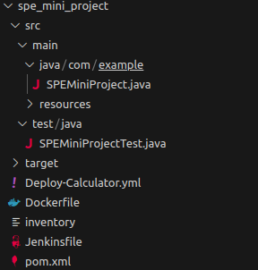
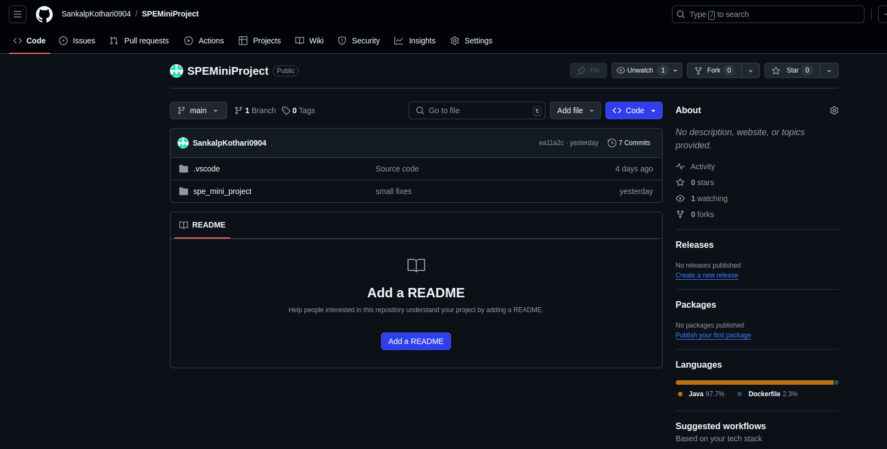
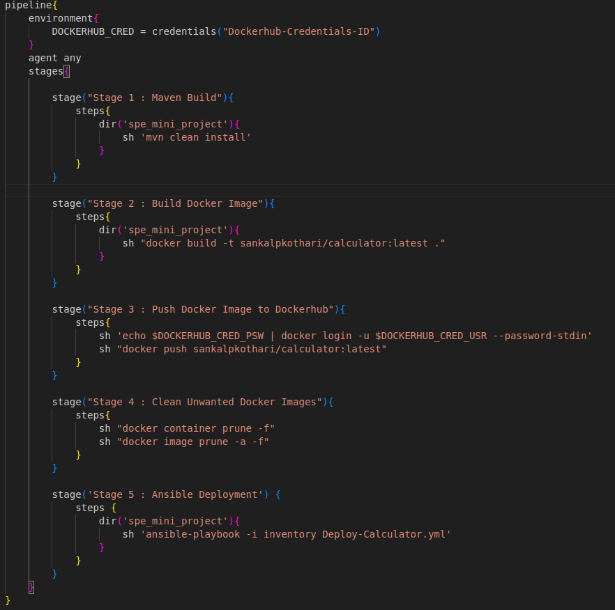
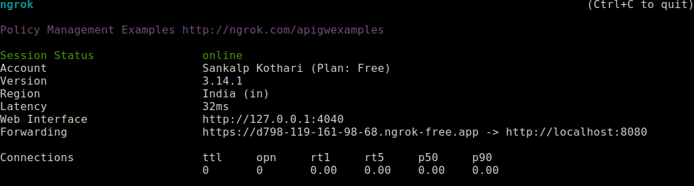
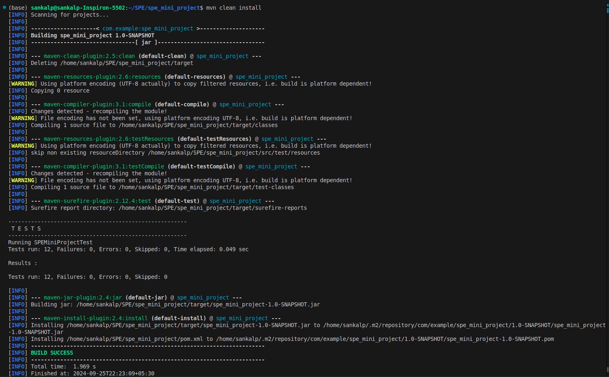
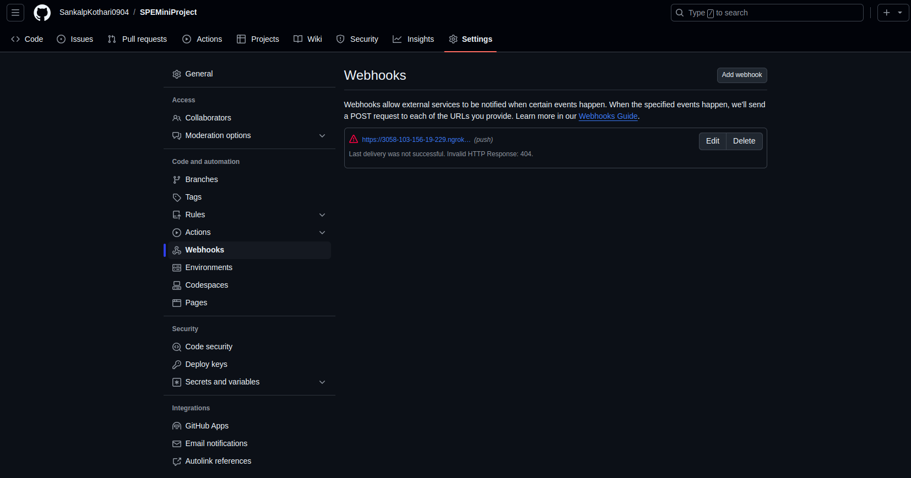
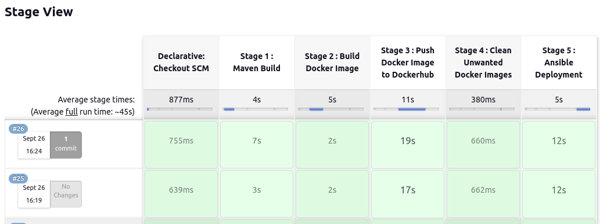
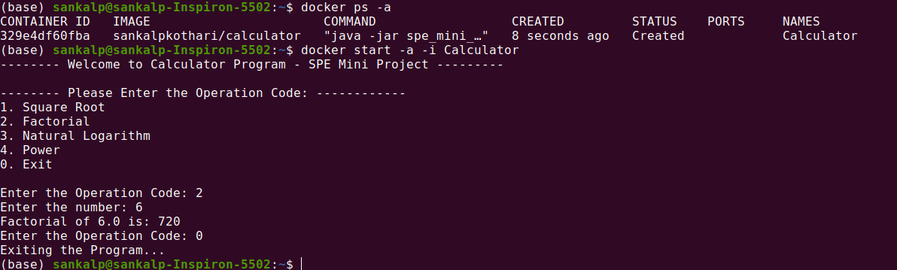

# Course: CS-816 Software Production Engineering
## Mini Project - Scientific Calculator with DevOps - Report
## IMT2021028 - Sankalp Kothari


### 1. Introduction & Application Overview
This project involves the development of a basic scientific calculator application capable of executing a variety of mathematical functions, which include:

1. **Square Root Calculation**: Given a decimal number, the application computes its square root. For negative numbers, the function returns `Double.NaN`.
2. **Factorial Calculation `x!`**: Given an integer input, the application computes its factorial. If the input is less than 0, the function returns `-1`.
3. **Natural Logarithm `ln x`**: For any given positive decimal number, the application returns its natural logarithm. If the input is less than 0, the function returns `Double.NaN`.
4. **Power**: The application calculates the result of a given base raised to a provided exponent, both of which can be decimal numbers.

In this report, I will provide an overview of the application and describe the DevOps tools used during its development. The primary tools integrated into the workflow include Maven, Jenkins, Github, Docker and Ansible.

### 2. What and Why of DevOps
DevOps is a practice that combines tools and techniques to improve how software development (Dev) and IT operations (Ops) work together. The goal is to make the development process faster and more reliable by automating tasks like testing, deployment, and managing infrastructure. Key features of DevOps include:

1. **Teamwork**: DevOps promotes better communication between development, operations, and other teams (such as security) to reduce barriers.
2. **Automation**: Routine tasks, such as testing and deploying software, are automated to save time and reduce manual work.
3. **Continuous Integration (CI)**: Developers regularly merge their code into a shared system, where it is tested automatically.
4. **Continuous Delivery/Deployment (CD)**: Software is automatically packaged and made ready for release or deployed in short, frequent cycles.
5. **Monitoring**: Constant monitoring of systems and applications helps to catch problems early, improving performance and reliability.

### Benefits of DevOps:
1. **Faster Releases**: Automating tasks like testing and deployment allows new features and fixes to be released more quickly.
2. **More Efficient Workflow**: With CI/CD, manual steps are reduced, leading to fewer mistakes and faster processes.
3. **Better Team Collaboration**: DevOps encourages teams, such as development and operations, to work closely together, improving overall coordination.
4. **Higher Software Quality**: Automated testing helps catch bugs early, resulting in more stable software.
5. **Scalability**: DevOps supports easier scaling of infrastructure to meet growing business needs.


### 3. Code
### 3.1 Directory Structure
There are 2 main directories here - src and target.

**`src`** contains the code and **`target`** contains generated output files. Inside **`src`**, there are 2 directories, `main` containing the main code, and `test` containing the unit tests written using ***JUnit***.

<p align="center">
  <br>
  <em>Fig 1. Directory Structure</em>
</p>

### 3.2 SPEMiniProject.java
Menu driven program that takes user input and works accordingly to give output.

### 3.3 SPEMiniProjectTest.java
THis file contains the tests for each of the mathematical operations. Written using JUNit. A couple of the test cases are shown below - 
```
public class SPEMiniProjectTest {
    // testing factorial for 10
    @Test
    public void testfactorial_1(){
        int observed = SPEMiniProject.Factorial(10);
        int expected = 3628800;
        Assert.assertEquals(observed, expected);
    }

    // testing natural logarithm for negative number
    @Test
    public void testlog_3(){
        double observed = SPEMiniProject.Logarithm(-10);
        double expected = Double.NaN;
        Assert.assertEquals(observed, expected,1e-10);
    }
}
```
<br>

### 4. DevOps Tools Used
### 4.1 Git and GitHub - Version Control Tool
`Git` is a distributed version control system that enables multiple developers to collaborate on a project at the same time. It keeps track of changes in the source code, allowing developers to manage different file versions, work together seamlessly, and roll back to previous versions if necessary.

`GitHub`, on the other hand, is a web-based platform built on top of Git. It provides hosting for Git repositories and offers additional features like collaboration tools, code reviews, and project management. This makes GitHub an essential tool for both open-source and private software development. The figure below displays a snapshot of the repository.

<p align="center">
  <br>
  <em>Fig 2. GitHub repository</em>
</p>

Link to the repository - [GitHub](https://github.com/SankalpKothari0904/SPEMiniProject)

### 4.2 Maven - Build Automation Tool
Maven is a build automation and project management tool, mainly used for Java projects but adaptable to other languages. It simplifies tasks like compiling code, managing dependencies, running tests, packaging applications, and deploying them.

#### **Why Use Maven?**
1. **Simplified Dependency Management**: Maven automatically handles library dependencies and resolves transitive dependencies (fetching dependencies required by your own).
2. **Standardized Project Structure**: It enforces a consistent directory layout, reducing configuration effort and making projects easier to navigate.
3. **Build Lifecycle Management**: Maven automates key phases of the build process, like compiling, testing, packaging, and deployment, ensuring consistency.
4. **Extensibility**: Through a rich ecosystem of plugins, Maven can handle additional tasks, such as code analysis and deployment.
5. **CI/CD Integration**: Maven integrates seamlessly with CI/CD tools like Jenkins and GitLab CI, automating builds, testing, and deployments.

#### **How Maven Works -** 
Maven projects are managed by the `pom.xml` file, which defines:
- **Project Information**: Basic details like project name, version, and description.
- **Dependencies**: External libraries required for the project.
- **Plugins**: Tools for building, testing, and packaging the project.
- **Build Phases**: Lifecycle stages like compile, test, package, and deploy.

When Maven runs, it reads the `pom.xml` file and executes the defined tasks. In this project, I used:
- **JUnit** for testing.
- **Maven Assembly Plugin** to package the project into a jar file.

Link to the `pom.xml` file: [POM](https://github.com/SankalpKothari0904/SPEMiniProject/blob/main/spe_mini_project/pom.xml)

### 4.3 Docker - Containerization Tool

Docker is an open-source platform designed to automate the deployment, scaling, and management of applications through containerization. A container is a lightweight, standalone, and executable unit that bundles everything needed to run an application, including code, runtime, libraries, and system dependencies. Docker containers are isolated from one another and from the host system, providing a consistent runtime environment.

Docker is widely used for its ability to ensure consistency, reduce deployment time, and enhance resource utilization, making it a powerful tool for modern application development.

### Key Features of Docker:
1. **Containerization:** Docker encapsulates applications and their dependencies into containers, ensuring consistent execution across various environments.
2. **Portability:** Containers are platform-independent and can run on any machine with Docker installed, whether it's a developer’s local machine, a cloud platform, or a production server.
3. **Isolation:** Containers are self-contained, preventing interference between applications running in different containers. This enhances security and optimizes resource management.
4. **Version Control:** Docker supports versioning of container images, enabling easy rollback to previous versions if needed.
5. **Efficient Resource Usage:** Unlike traditional virtual machines, Docker containers share the host system’s OS kernel, making them more lightweight and faster to launch.

### Benefits of Using Docker:
1. **Environment Consistency:** Docker ensures applications run identically across different environments—development, testing, or production—eliminating the "it works on my machine" problem.
2. **Rapid Deployment:** Docker containers can start in seconds, significantly reducing the time needed for deployment and scaling of applications.
3. **Microservices Architecture:** Docker excels in deploying microservices, as each service can run in its own container and be managed independently.
4. **Isolation and Security:** Docker isolates each application in its own container, providing better security and preventing resource conflicts between applications.
5. **CI/CD Integration:** Docker integrates seamlessly into Continuous Integration/Continuous Delivery (CI/CD) pipelines, enabling automated testing and consistent deployment.
6. **Resource Efficiency:** Compared to traditional virtual machines, Docker containers are more resource-efficient as they share the host OS kernel, resulting in lower overhead.

The following Dockerfile demonstrates a basic setup. It pulls the `openjdk:17` image from Docker Hub, fetches the necessary JAR files created by Maven, and runs the application.
```
FROM openjdk:17

COPY ./target/spe_mini_project-1.0-SNAPSHOT.jar ./

WORKDIR ./

CMD ["java", "-jar","spe_mini_project-1.0-SNAPSHOT.jar"]
```

### 4.4 Ansible - Configuration Management Tool
**Ansible** is an open-source automation tool designed for configuration management, application deployment, and task automation. It enables users to define tasks using Ansible Playbooks, which utilize a straightforward YAML syntax to specify the desired system state. 

One of Ansible's key advantages is ithat it does not require any agent software on the managed nodes. Instead, it uses SSH for Linux/Unix systems and WinRM for Windows systems to facilitate communication.

### Benefits of Using Ansible
1. **Automation**: Ansible streamlines repetitive IT processes such as server setup, application deployment, and configuration management, minimizing manual efforts.
2. **User-Friendly**: Its YAML-based declarative syntax makes Ansible intuitive and easy to learn for both developers and system administrators.
3. **Consistency**: Ansible playbooks ensure uniform execution of tasks, reducing the likelihood of errors and inconsistencies.
4. **Infrastructure as Code**: Ansible supports the IaC approach, enabling system configurations to be version-controlled and treated as code.
5. **Cross-Platform Compatibility**: It can manage a variety of operating systems (Linux, Windows, macOS) using a single playbook, enhancing versatility.
6. **Scalability**: Ansible is capable of managing both small-scale environments and large enterprise infrastructures, supporting various cloud platforms, virtual machines, and physical servers.

Below is the YAML file used in this project, which pulls the necessary image from Docker Hub and creates a corresponding container.
```
---
- name: Pull Docker Image of Calculator
  hosts: all

  tasks:
    - name: Start Docker Service
      service:
        name: docker
        state: started

    - name: Pull Image
      shell: docker pull sankalpkothari/calculator:latest

    - name: Run the container
      shell: docker create -it --name Calculator sankalpkothari/calculator
```

### 4.5 Jenkins - CI/CD Tool
Jenkins is an open-source automation server primarily used for continuous integration and continuous delivery (CI/CD) of software projects. It streamlines the software development process by automating tasks such as building, testing, and deploying code.

### Why Use Jenkins?
Jenkins offers a variety of features that enhance project management, including:

- **Continuous Integration**: Automatically builds and tests code whenever changes are committed to the repository.
- **Continuous Delivery**: Enables automatic deployment of code to production environments after passing automated tests and meeting predefined criteria.
- **Scalability**: Capable of handling large and complex projects, Jenkins can run on a single server or be distributed across multiple servers to manage high workloads effectively.

### Jenkins Pipeline for the Project
For this project, I created a pipeline-style project in Jenkins and began configuring it with a pipeline script. The pipeline consists of the following five stages:

1. **Stage 1: Maven Build**
   - In this stage, I executed the command `mvn clean install`, which first cleans the project and then installs the necessary dependencies.
   - This step includes running tests and producing the jar file as output.

2. **Stage 2: Build Docker Image**
   - Once the jar file is ready, the next step is to create a Docker image from it.
   - I added a `Dockerfile` to the project and ran the command `docker build -t sankalpkothari/calculator:latest .` to build the image.

3. **Stage 3: Pushing Docker Image to DockerHub**
   - After building the image, I pushed it to Docker Hub.
   - First, I logged in using the command `docker login`, followed by `docker push sankalpkothari/calculator:latest` to upload the image.

4. **Stage 4: Clearing Unwanted Images**
   - Before re-running the pipeline, it’s essential to clear any existing images that could interfere with the process.
   - I removed all containers and images present in the system to ensure a clean slate for the next execution.

5. **Stage 5: Pulling Docker Image using Ansible**
   - Finally, I included an inventory file and a playbook file in the project.
   - The playbook specifies tasks to pull the Docker image and run it as a container.

This pipeline effectively automates the processes involved in building, deploying, and managing the application, demonstrating the power of Jenkins in CI/CD.

Here's a snapshot of the same - 
<p align="center">
  <br>
  <em>Fig 3. Jenkinsfile</em>
</p>

### 4.6 Ngrok - Tool for triggering WebHooks
Ngrok is a tool that creates a secure tunnel from the public internet to a local development environment, allowing developers to expose local servers, APIs, or applications to the web through a temporary, secure URL. This is especially useful for sharing development work or testing webhooks and third-party services that need a publicly accessible endpoint.

In this project, Ngrok is used to configure webhooks. A webhook is set up in the GitHub repository, sending updates to the URL generated by Ngrok. This temporary URL creates a tunnel to localhost on port 8080, where Jenkins is running. With the necessary GitHub credentials provided to Jenkins, it can monitor the repository for changes and respond to updates notified via the webhook.

Here is an snapshot of the ngrok terminal :
Here's a snapshot of the same - 
<p align="center">
  <br>
  <em>Fig 4. Ngrok terminal running</em>
</p>

## 5. Project Configuration
### 5.1 Git
I have used the following commands for installing git on Ubuntu - 
```
sudo apt update
sudo apt install git
```
To confirm installation, one can use - 
```
git --version
```
For MacOS, installation can be done using the command - 
```
brew install git
```
For Windows - kindly refer to the link - [Git for Windows](https://git-scm.com/download/win)

### 5.2 Maven - 
The zip archives for downloading Maven can be found at the following website - [here](https://maven.apache.org/download.cgi), while the guide for installation can be found at the following link - [here](https://maven.apache.org/install.html).

### Project code and setup - 
We can create a new Maven Project in VS Code, and then we can add the source code to the project and the test code by adding dependencies for JUnit in the pom.xml file.

To build, we need to simply use the terminal command in the project directory (in our case - `spe_mini_project` )- 
```
mvn clean install
```
Here is the output for the same : 
<p align="center">
  <br>
  <em>Fig 5. Maven build output</em>
</p>

### 5.3 Ngrok Installation
The guides for installation for Ngrok for Windows, Mac and Ubuntu can be found here - [here](https://ngrok.com/download).

### 5.4 Webhook Configuration in GitHub
To set up webhooks, follow these steps:

1. Go to your GitHub profile and navigate to **Settings** → **Developer Settings** → **Personal Access Tokens** → **Tokens (Classic)**. From here, create a new Personal Access Token, ensuring you grant the necessary permissions. This token will be used later in the process.
   
2. Open your terminal and run the following command to generate a temporary URL, referred to as `TEMPORARY URL`. This will be used in the next steps.
```
ngrok http 8080
```
   
3. Open the GitHub repository where you want to set up webhooks. Navigate to **Settings** → **Webhooks** → **Add Webhook**. Specify the webhook URL as `TEMPORARY URL/github-webhooks/`. This will notify Jenkins (running on port 8080) of any changes in the repository.

The interface for adding the webhook is shown below.
<p align="center">
  <br>
  <em>Fig 6. Adding webhooks to GitHub repository</em>
</p>

### 5.5 Jenkins Installation and Configuration
Jenkins installation guide can be found [here](https://www.jenkins.io/doc/book/installing/).

To start Jenkins, use - 
```
sudo systemctl start jenkins.service
```
Then open the url `localhost:8080` on your browser to finish setup.

Install the required plugins for creating pipelined projects and the ones corresponding to Git, GitHub, Docker, Ansible and Maven and the restart Jenkins using - 
```
sudo systemctl restart jenkins
```

### 5.6 Docker Installation
Docker Installation Guide - [link](https://docs.docker.com/engine/install/)

Then we can create an account online and use those credentials in the local system - 
```
docker login -u <username>
```

Then we can simply add the jenkins user to docker user group in order to allow Jenkins to push images to Docker Hub using the following command - 
```
sudo usermod -aG docker jenkins
```

### 5.7 Ansible Installation
Ansible Installation Guide - [link](https://docs.ansible.com/ansible/latest/installation_guide/installation_distros.html)

### 5.8 Adding GitHub and Docker Credentials to Jenkins
We now open Jenkins and go to 

1. Manage Jenkins → Credentials → System → Global credentials.
2. For Github, we select secret kind to be Username and Password, keeping username as Github username and password as access token.
3. For Docker, we use the docker account's username and password, keeping id as **Dockerhub-Credentials-ID** as that has been used in the Jenkinsfile
4. For Ansible, we simply add the sudo username and password.

### 5.9 Creating a Pipelined Project in Jenkins
To create a pipeline project in Jenkins, start by opening the Jenkins Dashboard. Then, navigate to **New Item** → **Pipeline Project**, and enter the desired project name. Make sure to check the following options:

- **GitHub Project**
- **GitHub hook trigger for GITScm polling**
- Set **Definition** to *"Pipeline Script from SCM"*, and select **Git** as the SCM option.

When prompted, provide the GitHub repository URL, along with the GitHub credentials created earlier. Finally, select the correct branch of the GitHub repository. This completes the pipeline project setup.

### Running the application
Since we have initialised the project to work on Git SCM polling, whenever we push a change to the repository, the Jenkins server automatically builds if the ngrok url in the webhook is updated.

We can also manually build using the Build Now option in Jenkins.

### 6. Results
### 6.1 Output of the Running Stages in Jenkins
<p align="center">
  <br>
  <em>Fig 7. Running Stages in Jenkins</em>
</p>

### 6.2 Images created on DockerHub and the Output of the Running Image
<p align="center">
  <br>
  <em>Fig 8. Image on DockerHub and output</em>
</p>